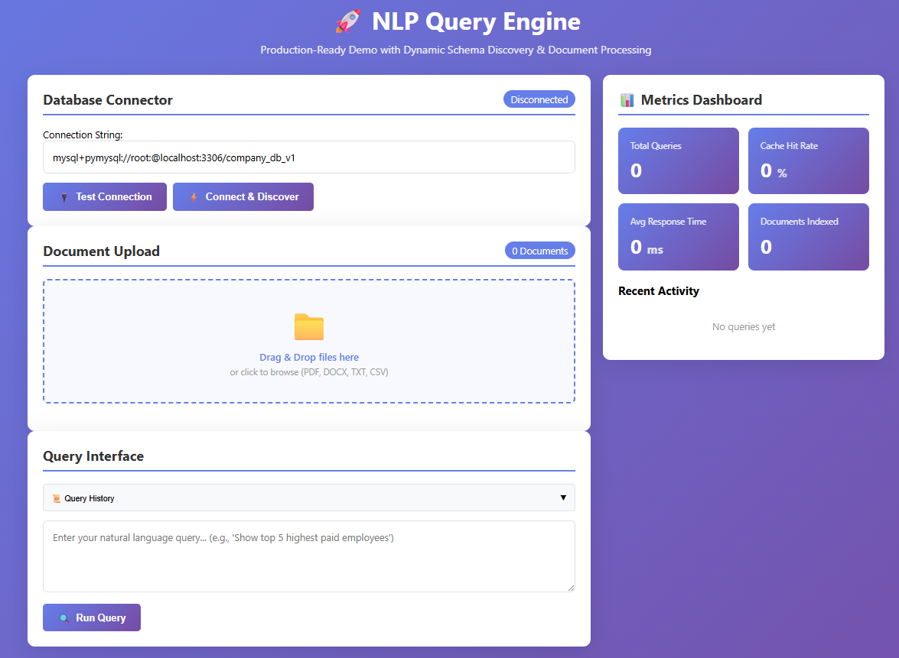

# NLP-Query-Engine-for-Employee-Data


## Project Overview

This project implements a Natural Language Processing (NLP) Query Engine designed to interact with both **structured** (SQL database) and **unstructured** (documents/RAG) data sources. The core goal is to provide a unified, schema-agnostic interface that allows users to query employee data using plain English, eliminating the need to write complex SQL or search through large document repositories.

---

## 🎯 Use Case & Purpose

This project is ideal for:

- 💻 **AI Engineering Demos** showcasing a full-stack RAG system with dynamic schema integration.
- 🏢 **Enterprise Search Solutions** where users need to query both structured employee records and unstructured policy documents.
- ⚙️ **Testing and Learning** advanced RAG (Retrieval-Augmented Generation) architectures using Sentence-Transformers and FAISS.
- 🎓 **Educational Demos** in database schema introspection and NL-to-SQL generation.

> ⚠️ **Disclaimer:** This system uses local, open-source models (Sentence-Transformers) and is highly configurable. Performance relies heavily on the quality of the model and the structured data schema.

---

## ✨ Key Features

* **Dynamic Schema Discovery:** Connects to a database (PostgreSQL/MySQL) and automatically discovers table, column, and relationship metadata using **SQLAlchemy** (see `schema_discovery.py`).
* **Natural Language to SQL:** Generates suggested SQL queries from English questions, adapting to the discovered schema.
* **Unstructured Data Indexing (RAG):**
    * Supports ingestion of documents (PDF, DOCX, TXT) via a multi-threaded, asynchronous process.
    * Uses **Sentence-Transformers** for generating high-quality vector embeddings.
    * Employs **FAISS** for highly performant vector indexing and semantic search.
* **Performance Optimization:** Includes in-memory query caching, request metrics, and a dedicated health check endpoint.

---

## 💡 How to Use the NLP Query Engine

Once the application is running (as detailed in the **"Running the Application"** section of the main README), you can interact with the system via the web interface served at:

The system operates in three main phases: **Setup**, **Ingestion**, and **Querying**.

---

### ⚙️ Phase 1: Setup and Schema Discovery (Structured Data)

This project requires knowing the structure of your data. You have two main options for setting up your data source:

#### 🔗 Connect to a Database (Structured Data)

- **What you need**: The SQLAlchemy connection string for your target database (e.g., PostgreSQL, MySQL).
- **Action**: In the web interface's **Database Panel**, input your connection string and click **"Connect and Discover Schema"**.
- **System Action**:  
  - The backend connects to the database.  
  - Inspects all tables, columns, and relationships.  
  - Stores this schema information (via the `/api/schema/connect-database` endpoint) to inform future NL-to-SQL conversions.  

---

#### 📄 Prepare Unstructured Documents (RAG Data)

- **What you need**: Documents containing employee-related text (policies, resumes, handbooks) in formats like **PDF, DOCX, or TXT**.
- **Action**: In the web interface's **Data Ingestion Panel**, use the drag-and-drop area to upload your files.


### 📥 Phase 2: Document Ingestion and Indexing

This process prepares your unstructured data for **semantic searching (RAG)**.

1. **Upload Documents**:  
   - Upload files via the web interface (this hits the `/api/ingest/documents` endpoint).  

2. **Indexing**:  
   The server processes the files asynchronously:  
   - Extracts text and splits it into manageable chunks.  
   - Generates vector embeddings for each chunk using the **Sentence-Transformer model**.  
   - Adds these embeddings to the **FAISS vector index** for fast retrieval.  

3. **Monitor Status**:  
   - Use the **Ingestion Status tab** (or the `/api/ingest/status` endpoint) to ensure all documents are successfully processed and indexed before querying.  


### 🔎 Phase 3: Querying the System

Once your data sources (structured, unstructured, or both) are set up, you can start asking questions.

#### 📝 Input a Query

Type your question into the main query input box.  
Examples:  
- `"Which employees earn more than $70,000?"`  
- `"What is the policy for remote work?"`

#### ⚡ Query Processing (Core Logic)

The system (via the `/api/query` endpoint) automatically determines the best way to answer:

- **Structured Intent (SQL)**:  
  - For numerical data, filtering, or counting (e.g., `"Count all employees in IT"`).  
  - It uses the discovered schema to generate and execute an SQL query.  

- **Unstructured Intent (RAG)**:  
  - For conceptual or policy-based information (e.g., `"What is the vacation entitlement for new hires?"`).  
  - Performs a **semantic search** against the FAISS index to retrieve the most relevant document chunks.  

#### 📊 View Results

- **Structured Results**: Displayed in a **clean, scrollable data table**.  
- **Unstructured Results**: Displayed as **cards** showing retrieved text chunks and their source filename.  

#### 📈 Check Metrics

Observe the **Performance Metrics panel** to view:  
- Response time  
- Cache hit/miss ratio  
- Overall system optimization  


---
## 🛠 Tech Stack

| Category | Technology | Purpose |
| :--- | :--- | :--- |
| **Backend Framework** | Python / Flask | High-performance, lightweight API server. |
| **Database ORM** | SQLAlchemy | Abstract database interaction and dynamic schema inspection. |
| **Vector Search** | FAISS | Efficient indexing and retrieval of document embeddings. |
| **NLP/Embeddings** | Sentence-Transformers | Generating vector representations for semantic search (RAG). |
| **ML/Utilities** | PyTorch, NumPy, scikit-learn | Core dependencies for model execution and utility functions. |
| **Client** | HTML/JavaScript (via `index.html`) | Simple web interface for interaction. |

---

## 🎬 Project Demo

<div align="center">
  <a href="https://drive.google.com/file/d/1qTE3pssaGR8LOkpC9CuVRxdd6PT2ciOj/view?usp=drive_link" target="_blank">
    
  </a>
  <br>
  <strong><a href="https://drive.google.com/file/d/1qTE3pssaGR8LOkpC9CuVRxdd6PT2ciOj/view?usp=drive_link" target="_blank">▶️ Watch: NLP-Query-Engine-For-Data</a></strong>
  <p>Video by Data Science Solutions</p>
</div>

---
## 🚀 Setup and Installation

### Prerequisites

* Python 3.8+
* A target database (e.g., PostgreSQL or MySQL) is highly recommended for full functionality.

### 1. Clone the repository

```bash
git clone https://github.com/Uvais5/NLP-Query-Engine-for-Employee-Data
cd project NLP-Query-Engine-for-Employee-Data
```
### 2.Set up a Virtual Environment and Install Dependencies
```bash
python3 -m venv venv
source venv/bin/activate  # On Windows, use `venv\Scripts\activate`
pip install -r requirements.txt
```
### 3. Running the Application
```
python app.py
```
